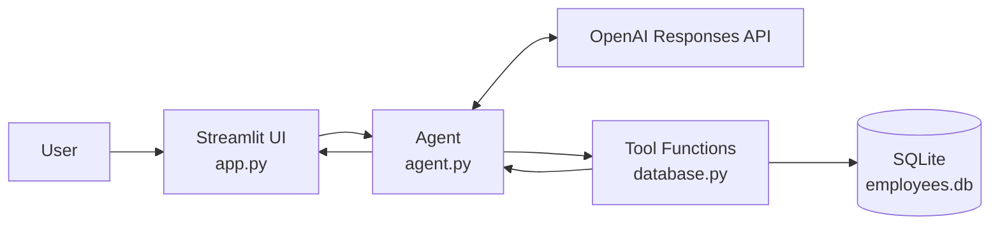

# 🤖 AI Employee Database Agent

An AI-powered employee management app that lets you **create, read, update, delete, and search** employee records using plain English. Built with **OpenAI Function Calling**, **SQLite**, and **Streamlit**.

> The AI never writes or executes raw SQL. It decides *which* Python tool to call, and the tool runs a safe, parameterized query against SQLite.

---

## ✨ Features

- **Natural-language interface**: ask questions like *"Who has the highest salary?"* or *"Add Rahul to IT with salary 55000."*
- **Full CRUD**: create, view, update, and delete employees.
- **Smart search**: by partial name, department, city, salary range, or department + minimum salary.
- **Analytics helpers**: employee count and highest-paid employee.
- **Streamlit UI**: an AI chat tab, a live employee table, and an About page.
- **Safe by design**: parameterized SQL queries, strict tool schemas, and a unique-email constraint.
- **Agentic loop**: the model can chain several tool calls before giving a final answer.

---

## 🏗️ Architecture



**Flow:** User → OpenAI Agent → Python Tool → SQLite → result returned to the agent → natural-language answer.

---

## 🧰 Tech Stack

| Layer      | Technology                         |
|------------|------------------------------------|
| Language   | Python 3                           |
| LLM        | OpenAI Responses API (function calling) |
| Database   | SQLite (`sqlite3` standard library) |
| Frontend   | Streamlit                          |
| Config     | python-dotenv                      |

---

## 📁 Project Structure

```
.
├── app.py               # Streamlit web application
├── agent.py             # OpenAI agent, tool schemas, and tool-calling loop
├── database.py          # SQLite connection and all database operations
├── test_agent.py        # Interactive CLI to chat with the agent
├── test_database.py     # Manual script to exercise the database layer
├── requirements.txt     # Python dependencies
├── employees.db         # SQLite database (created automatically)
└── .env                 # Your API key (not committed)
```

---

## 🗄️ Database Schema

**Table: `employees`**

| Column       | Type    | Constraints                   |
|--------------|---------|-------------------------------|
| `id`         | INTEGER | PRIMARY KEY, AUTOINCREMENT    |
| `name`       | TEXT    | NOT NULL                      |
| `email`      | TEXT    | NOT NULL, UNIQUE              |
| `department` | TEXT    | NOT NULL                      |
| `salary`     | REAL    | NOT NULL                      |
| `city`       | TEXT    | NOT NULL                      |

---

## 🛠️ Agent Tools

The agent can call the following functions, each defined with a strict JSON schema:

| Tool                       | Description                                          |
|----------------------------|------------------------------------------------------|
| `create_employee`          | Add a new employee                                   |
| `get_employee`             | Fetch an employee by ID                              |
| `get_all_employees`        | List all employees                                   |
| `update_employee`          | Update an employee's details                         |
| `delete_employee`          | Delete an employee by ID                             |
| `search_by_name`           | Partial, case-insensitive name search                |
| `search_by_department`     | Filter by department                                 |
| `search_by_city`           | Filter by city                                       |
| `search_by_salary`         | Filter by salary range                               |
| `count_employees`          | Total number of employees                            |
| `highest_salary`           | Employee with the highest salary                     |
| `search_department_salary` | Employees in a department earning at least a salary  |

---

## 🚀 Getting Started

### Prerequisites

- Python 3.9+
- An [OpenAI API key](https://platform.openai.com/api-keys)

### 1. Clone the repository

```bash
git clone https://github.com/<your-username>/<your-repo>.git
cd <your-repo>
```

### 2. Create a virtual environment (recommended)

```bash
python -m venv venv

# macOS / Linux
source venv/bin/activate

# Windows
venv\Scripts\activate
```

### 3. Install dependencies

```bash
pip install -r requirements.txt
```

### 4. Configure your API key

Create a `.env` file in the project root:

```env
OPENAI_API_KEY=your_openai_api_key_here
```

### 5. Run the app

```bash
streamlit run app.py
```

The app opens at `http://localhost:8501`. The database and table are created automatically on first launch.

---

## 💬 Example Prompts

```
Show all employees.
How many employees are there?
Find employees from IT.
Find employees from Kolkata.
Who has the highest salary?
Find employees earning between 40000 and 60000.
Find IT employees earning at least 50000.
Add Rahul as an IT employee with salary 55000.
Update employee 1 salary to 65000.
Delete employee 3.
```

> **Tip:** the `create_employee` and `update_employee` tools require all fields (name, email, department, salary, city). If you leave any out, the agent may ask you for them.

---

## 🧪 Testing

**Chat with the agent in your terminal:**

```bash
python test_agent.py
```

Type `exit` to quit.

**Exercise the database layer directly:**

```bash
python test_database.py
```

This inserts sample employees and prints the results of several queries. Running it more than once will report "Email already exists" for the duplicate sample rows, which is expected.

---

## 🔒 Security Notes

- All SQL uses **parameterized queries**, which protects against SQL injection.
- The model can only invoke the whitelisted tools above; it has no direct database access.
- The system prompt instructs the agent to confirm the target employee before destructive actions such as deletion.
- Keep your `.env` file out of version control by adding it to `.gitignore`:

```gitignore
.env
venv/
__pycache__/
```

---

## 🗺️ Roadmap

- [ ] Conversation memory across multiple turns in the Streamlit UI
- [ ] Explicit confirmation step before delete operations
- [ ] Case-insensitive department and city matching
- [ ] Pagination and sorting in the employee table
- [ ] Automated unit tests with `pytest`
- [ ] Docker support

---

## 🤝 Contributing

Contributions are welcome!

1. Fork the repository
2. Create a feature branch: `git checkout -b feature/your-feature`
3. Commit your changes: `git commit -m "Add your feature"`
4. Push to the branch: `git push origin feature/your-feature`
5. Open a Pull Request

---

## 📄 License

This project is licensed under the [MIT License](LICENSE). *(Add a `LICENSE` file to your repository.)*

---

## 🙌 Acknowledgements

- [OpenAI](https://platform.openai.com/) for the function-calling API
- [Streamlit](https://streamlit.io/) for the rapid UI framework
- [SQLite](https://www.sqlite.org/) for the lightweight embedded database
